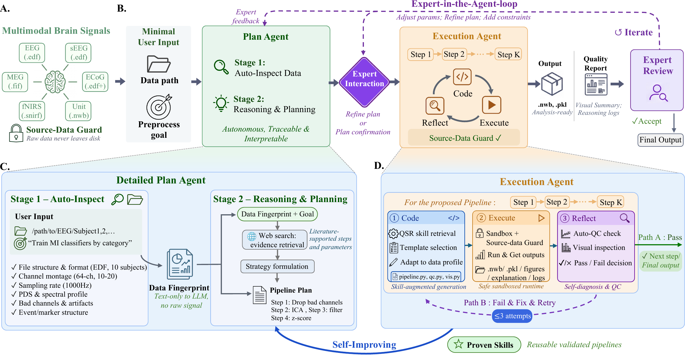

# EasyBCI-Data Agent

**A multimodal neural-data preprocessing agent.**
Researchers describe their processing intent in natural language. DataAgent orchestrates skills, generates code, executes and validates it, and produces reproducible AI-Ready data together with full visual evidence.

📘 **[Usage Guide](/asset/USAGE.en.md)**

<p align="center">
  
</p>

---

## Key Design

| Principle | Description |
|-----------|-------------|
| **Flywheel effect** | Every successful preprocessing run is auto-saved as a Proven Pipeline Skill. Similar data later can reuse the validated parameters and flow, getting more accurate the more you use it. |
| **Interpretability** | Preprocessing flows and parameters can be backed by evidence retrieved via Web Search; every decision in the chain is traceable and auditable. |
| **Zero data leakage** | Raw data always stays local. The LLM only receives a text-form Data Fingerprint and never touches any raw signal. |

---

## 1. Quick Start

### 1.1 Requirements

- Python 3.12+
- Node.js 20+ (only for WebUI development; release packages ship prebuilt assets)
- An LLM API key (OpenAI / Anthropic / any OpenAI-compatible endpoint / local DeepSeek)

### 1.2 Install

```bash
git clone git@github.com:zhuyu-cs/EasyBCIdata-agent.git && cd EasyBCIdata-agent

# Automated install (creates venv, installs deps via uv)
./setup-easybci.sh
```

### 1.3 Optional Tool Configuration

Two ways to configure.

- **WebUI (recommended).** Launch `easybci dashboard`, then open **Settings → Web Search**, pick a provider (Tavily / Exa) from the dropdown and paste an API key. It takes effect immediately.
- **CLI / `.env`.** Edit `~/.easybci/.env`, fill in the relevant key, and restart.

| Tool | Purpose | How to configure |
|------|---------|------------------|
| **Web Search** | Search docs & papers online | `TAVILY_API_KEY` ([tavily.com](https://tavily.com)) or `EXA_API_KEY` ([exa.ai](https://exa.ai)) |
| **Skills Hub** | Search/install community skills from GitHub | `GITHUB_TOKEN=ghp_xxx` |

> These tools are **optional enhancements** and do not affect the core BCI preprocessing. With no web-search key set, the agent behaves identically.
> We do, however, **recommend configuring Web Search**. It meaningfully improves EasyBCI's ability to handle complex, unfamiliar data.

### 1.4 Run

```bash
# CLI mode (recommended)
easybci

# Resume the previous session
easybci --resume last

# WebUI dashboard. Auto-starts the Gateway and opens http://localhost:9119 in your browser
easybci dashboard
#   --port 9119      Dashboard port (default 9119)
#   --no-open        Don't open the browser automatically
#   --no-gateway     Don't auto-start the Gateway SSE server

# Gateway HTTP API only (advanced; for editor / custom-frontend integration, port 8642)
API_SERVER_ENABLED=true API_SERVER_PORT=8642 \
  python -m services.gateway.run
```

> **Usage recommendation.** Keep each session focused on a single dataset, both in the WebUI and in the CLI. A focused context helps the agent make better preprocessing decisions and avoids interference between unrelated data. Start a fresh session for a new dataset (click "New Session" in the WebUI, or re-launch `easybci` in the CLI).

> **Write a good first message.** In your very first command, state three things so the agent can plan well from the start.
> - **Data path.** Where the raw data lives (a file or a directory to batch-process).
> - **Analysis goal.** The downstream methodology, such as `classification`, `source_localization`, `feature_extraction`, `clinical_screening`, `connectivity`, `phase_amplitude_coupling`, or `online_inference` (use `exploratory` or `generic` if unsure).
> - **Scenario.** The delivery context, one of `research` (default), `clinical`, or `deployment`.
>
> Example. *"Preprocess /data/sub01_mi.edf for motor-imagery classification, research scenario."* You don't have to get every field right, since the agent will ask when something is missing, but providing them upfront skips a round-trip and yields a better pipeline.

> **Detailed usage** — CLI built-in commands, input shortcuts, the WebUI three-column workspace, file-browser flows, and session management are all covered in the Usage Guide: [English](/asset/USAGE.en.md). 

---

## 2. Data Format Support

**Input.** No format restrictions. The user provides a data path and the agent auto-detects the format, writing a loader if needed.
**Output.** Unified as NWB (preprocessed data) and pkl (AI-Ready data).

Already-supported formats.

| Backend | Formats | Modalities |
|---------|---------|-----------|
| MNE | `.edf` `.bdf` `.fif` `.set` `.cnt` `.gdf` `.vhdr` `.ds` `.eeg` | EEG, MEG, sEEG, ECoG |
| HDF5 | `.nwb` `.h5` `.hdf5` | Spike, generic |
| MATLAB | `.mat` | FieldTrip, EEGLAB, generic |
| Tabular | `.csv` `.tsv` `.parquet` | Any |
| Streaming | `.xdf` `.xdfz` | Multimodal (LSL) |
| NumPy | `.npy` `.npz` | Any |
| Pickle | `.pkl` | Any |

For uncovered formats, the agent auto-installs the needed package and writes the reader code.

---

## 3. Output Structure (Mini-Repo)

Each run produces a reproducible mini-repo that **includes full visual evidence**. Preprocessed data is written as NWB (the default and only format for the preprocessed layer), while AI-Ready segments use `.pkl` so downstream ML loaders can pick them up directly.

```
{subject}_preprocess_work_dir/
├── README.md
├── pipeline_record.json
├── plan/                          # proposal.json + reasoning.md + goal.json
│                                  #   (+ web_evidence.json when Web Search is enabled)
├── code/                          # pipeline.py + qc.py + vis.py + run.py
│                                  #   + requirements.txt (+ build_ai_ready.py when events/labels exist)
├── preprocessed_output/
│   ├── preprocessed/sub-{id}/ses-{ses}/*_preprocessed.nwb   # preprocessed data (NWB, BIDS-compatible)
│   ├── AI_ready/{id}/{ses}/*_epochs.pkl                     # epoched / segmented data
│   ├── figures/sub-{id}/ses-{ses}/                          # visual evidence produced by vis.py
│   └── QC_out/sub-{id}/ses-{ses}/qc_report.{json,md}        # QC report
└── middle_process/                # intermediate-artifact archive (auditable on rerun)
```

> The output schema is governed by a single source of truth, `easybci_lib/tools/neural_processing/export/contract_check.py`. Downstream skills (the Proven Pipeline flywheel, reproducibility verification) depend on this layout, so do not rename top-level subdirectories by hand.

---

## 4. Interaction Example

```
Researcher  Preprocess /data/sub01_mi.edf for motor-imagery classification

DataAgent
  [INSPECT]  Detected EDF format, 64ch EEG, 512Hz, 180s
  [PLAN]     Loading motor_imagery domain knowledge + retrieving proven pipelines
  [PROPOSE]  Pipeline: notch→50 bandpass→0.5,40 resample→256 scale→robust
             Per-step rationale: [data observation] → [signal-processing principle] → [expected effect]
  Awaiting confirmation ✓

Researcher  Confirmed

DataAgent
  [GENERATE] Generated pipeline.py / qc.py / vis.py / run.py
  [EXECUTE]  Running... ✓ → NWB preprocessed output + figure set auto-produced
  [QC]       Channel variance normal, spectrum clean, PASS
             → See preprocessed_output/figures/sub-01/ses-01/ to confirm the filtering
  [OUTPUT]   mini-repo exported to /data/sub01_mi_preprocess_work_dir/

  Done! Save this run as an experience reference? [default: save]

Researcher  Yes

DataAgent
  [SAVE]     Experience saved as skill: eeg-motor_imagery-64ch-256hz
             Similar data will automatically reference this flow next time.
```

---

## Acknowledgements

Parts of the agent-management design in EasyBCI-Data Agent are inherited from [**Hermes-Agent**](https://github.com/nousresearch/hermes-agent). Thanks for the open-source groundwork.
