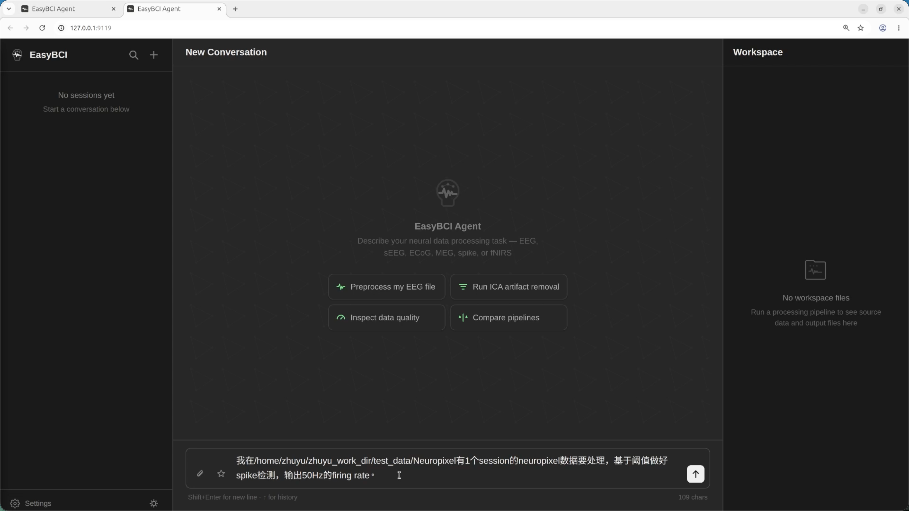
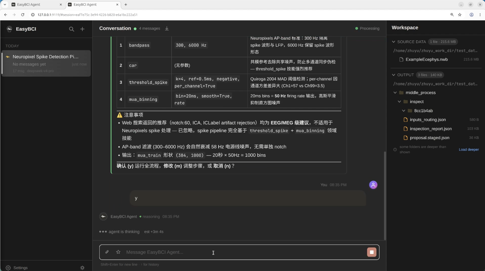

# EasyBCI Usage Guide

This document describes how to drive EasyBCI from the CLI and from the WebUI. Both share the same agent core. The primary interaction model in either front-end is a natural-language conversation where you describe what you want done with your data.

---

## 1. Overview

EasyBCI ships two front-ends.

- **CLI**. A terminal REPL. Best for SSH sessions, scripted runs, and minimum-latency interaction.
- **WebUI**. A browser dashboard launched by `easybci dashboard`. Best for local work that benefits from inline figures, structured cards, and a persistent file browser.

You do not need to learn a command language. Type your intent in natural language ("preprocess `/data/sub01.edf` for motor imagery classification") and the agent plans, generates code, executes, and reports back.

---

## 2. CLI

### 2.1 Launching

```bash
easybci                 # start a fresh session (REPL)
easybci --resume last   # resume the most recent session
```

After the banner you land at the prompt. Type your request and press Enter to send. Use Shift+Enter for multi-line input.

### 2.2 Built-in commands

You can use either the bare verb or the slash-prefixed form, both are accepted.

| Command | Effect |
|---------|--------|
| `/help` | Show all available commands and shortcuts |
| `/tools` | List, enable, or disable tools |
| `/toolsets` | Show available toolset bundles |
| `/skills` | Browse, search, or install community skills (Skills Hub) |
| `/sessions` | List recent sessions and pick one to resume |
| `/resume` | Resume a session by id or name |
| `/new` | Start a fresh session in place |
| `/clear` | Clear the screen and start a fresh session |
| `/config` | Print the effective configuration |
| `/exit` (or `/quit`) | Leave the REPL |

`/help` is the discovery entry point. Run it once after install to see the full surface, including slash commands contributed by skills and plugins.

### 2.3 Input shortcuts

- `Shift+Enter` adds a newline
- `↑` / `↓` recall recent inputs
- `Ctrl+C` interrupts the current run
- `Ctrl+L` redraws the screen after multiplexer or terminal artifacts
- `Tab` completes built-in commands and file paths

### 2.4 One session, one dataset

Each session is a focused context for a single dataset. When you move to a new recording, start a fresh session with `/new` or relaunch `easybci`. Mixing datasets in one session leads to weaker preprocessing decisions because the data fingerprint and the dialogue history start to disagree.

---

## 3. WebUI

Start the dashboard with `easybci dashboard`. It picks port `9119` by default and opens your browser. The Gateway SSE server on port `8642` is auto-spawned.

### 3.1 Layout

The dashboard is a three-column workspace. The left column holds your sessions, the middle column is the conversation, and the right column is the file workspace that mirrors your source data and the run output.

<p align="center">
  
</p>

The figure above shows the empty state right after launch. The middle panel exposes four quick-start chips that pre-fill an example prompt, and the bottom input box accepts the message you want to send.

<p align="center">
  
</p>

Once a run is in progress the middle panel streams structured cards (proposal tables, per-step rationale, QC summaries) while the right panel populates with the source files and the generated mini-repo.

### 3.2 Sessions (left column)

The session list for the current profile.

- Click a row to switch into that session
- `+` at the top creates a new session
- The search icon filters by title
- Right-click a row for `Rename` and `Archive`
- `Settings` at the bottom-left opens the global settings panel

### 3.3 Conversation (middle column)

The main interaction surface. All input is plain natural language.

- **Quick-start chips** in the empty state, four prefilled task templates (Preprocess EEG, Run ICA artifact removal, Inspect data quality, Compare pipelines)
- **Input box**, multi-line (`Shift+Enter` for newline), arrow-key history recall, paperclip attachments, star to bookmark a prompt, live character counter
- **Structured cards** stream in during a run instead of raw text, including the proposal table, per-step rationale, QC metrics, and a final summary card with the mini-repo path
- **Stage progress ribbon** at the top showing the current phase (plan, codegen, preprocess, qc), percent complete, and an ETA estimated from your past runs on similar data
- **Approval dialog** for shell commands, file overwrites, and source-adjacent writes, with single-shot approve, session-wide approve, or reject
- **Stop button** next to the input cleanly interrupts the run; partial outputs are preserved under `middle_process/` inside the work directory

### 3.4 Workspace (right column)

A live mirror of the relevant files on disk. Two sections.

- **SOURCE DATA**, your input directory, registered as immutable so the agent cannot overwrite, delete, or move anything inside it
- **OUTPUT**, the mini-repo work directory being produced (`{subject}_preprocess_work_dir/`), updated incrementally

Interactions.

- **Click any file** to open the preview panel. Text formats (`.py`, `.json`, `.md`, `.yaml`, `.csv`, `.txt`, `.log`) render inline; images (`.png`, `.jpg`, `.svg`, ...) render as images
- **Right-click a file** for `Copy path`, `Open in preview`, and `Delete` (Output side only)
- **Right-click empty space** for `Refresh`
- **`Load deeper`** at the bottom of each section expands the tree past the default depth, useful for large work directories

### 3.5 Settings

Reachable from the bottom of the left column. Two groups matter day-to-day.

- **Model & Theme**. Pick the LLM provider and model for this profile, and switch between light and dark themes.
- **Web Search**. Choose a provider (Tavily, Exa) and paste an API key. Changes take effect immediately.

---

## 4. Recommended workflow

1. Start a fresh session for each new dataset.
2. Pass an absolute path when you reference your data. The agent resolves relative paths against the launch directory and that can be surprising under `easybci dashboard`.
3. After the agent proposes a pipeline, confirm once and let it run end-to-end. The structured cards and the inline progress are designed to be read in flight.
4. When a step fails, the agent retries with adaptive recovery. If it still cannot make progress, open `plan/reasoning.md` and `preprocessed_output/QC_out/.../qc_report.md` in the workspace preview, then send a follow-up message in the same session correcting the assumption that broke.
